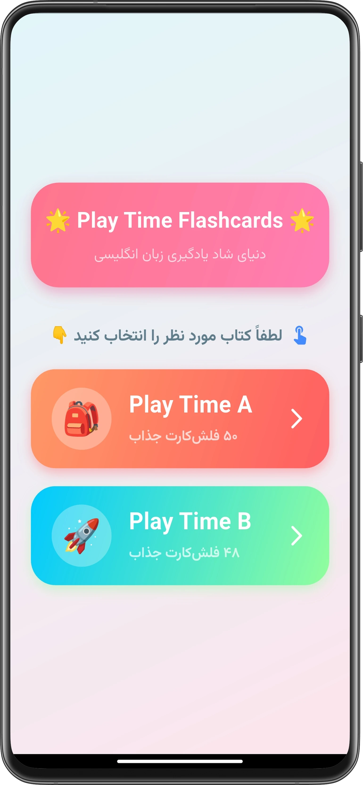
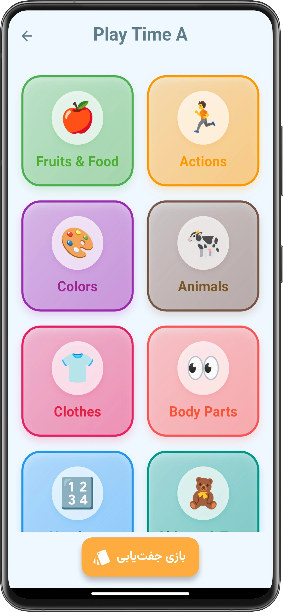
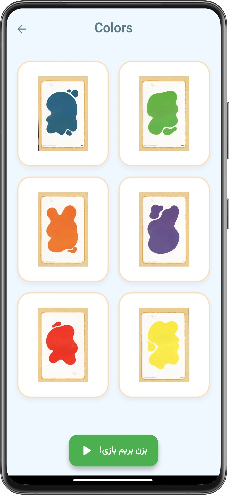
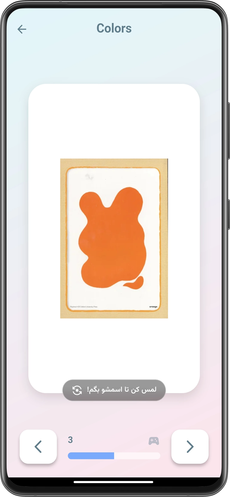
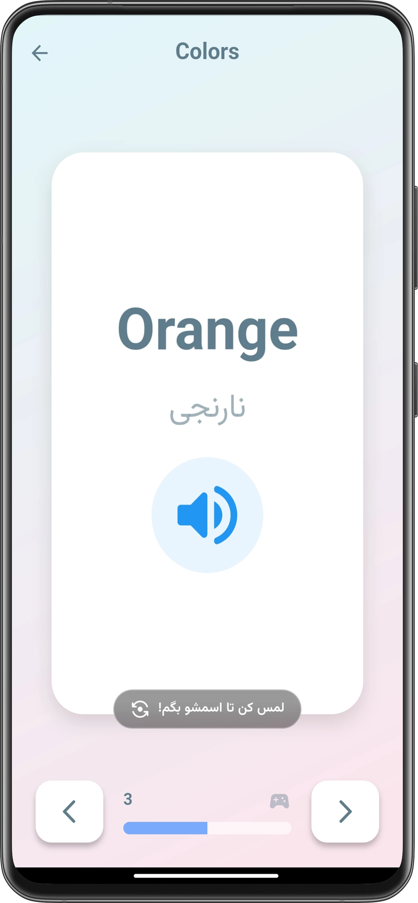
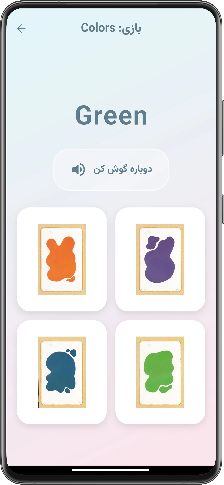

# 🃏 PT Cards (Play Time)
[🇮🇷 برای مطالعه توضیحات به زبان فارسی کلیک کنید](#-فارسی)

A joyful and interactive English learning world designed specifically for children. PT Cards is a modern educational platform that transforms learning basic English vocabulary into a delightful experience through visual and audio methodologies.

**🌐 Live Demo:** [playtime.hakimdev.ir](https://playtime.hakimdev.ir)

## 📸 Screenshots

  
  
  

  
  
  

## ✨ Features

| Category | Description |
| :--- | :--- |
| **📚 Rich Content** | Includes complete content from "Play Time A & B", 9 practical categories (fruits, animals, colors, etc.), and over 100 high-quality visual flashcards. |
| **🎨 UI/UX for Kids** | Modern Glassmorphism design with joyful pastel colors, fully responsive across Mobile, Tablet, and Windows, featuring standard bilingual typography. |
| **🔊 Smart TTS** | Native American (en-US) pronunciation, adjustable slow pace for better comprehension, and highly stable audio state management without overlaps. |
| **🎮 Gamification** | Interactive 3D Flip Cards, visual Memory Match game with celebration effects, and Listen & Match audio challenge. |
| **🛠 Technical Standards** | Blazing fast Native performance, smart desktop window constraints, and precise App Lifecycle management to optimize resources and battery. |

## 🚀 Built With

*   **Framework:** [Flutter](https://flutter.dev/) (Stable Channel)
*   **Language:** Dart
*   **Audio:** `flutter_tts`
*   **Desktop:** `window_manager`
*   **UI Assets:** Custom UI constraints & `confetti` for game rewards

## 💻 Getting Started

To run this project locally, follow these steps:

1. Clone the repository:
   git clone https://github.com/AHakimDev/playtime_flashcards.git

2. Navigate to the project directory:
   cd playtime_flashcards

3. Install dependencies:
   flutter pub get

4. Run the app:
   flutter run

---

## 🇮🇷 فارسی
[🇬🇧 Read this in English](#-pt-cards-play-time)

دنیای شاد و تعاملی یادگیری زبان انگلیسی برای کودکان! اپلیکیشن PT Cards یک پلتفرم آموزشی مدرن است که با استفاده از متدهای بصری و صوتی، یادگیری کلمات پایه انگلیسی را برای کودکان به یک تجربه لذت‌بخش تبدیل می‌کند.

**🌐 پیش‌نمایش زنده:** [playtime.hakimdev.ir](https://playtime.hakimdev.ir)

## ✨ ویژگی‌ها و امکانات

| بخش | توضیحات |
| :--- | :--- |
| **📚 محتوای آموزشی غنی** | دو سطح استاندارد (Play Time A & B)، ۹ دسته‌بندی کاربردی (میوه‌ها، حیوانات، رنگ‌ها و...) و بیش از ۱۰۰ فلش‌کارت تصویری جذاب. |
| **🎨 تجربه بصری (UI/UX)** | طراحی Glassmorphism با رنگ‌های پاستلی شاد برای کودکان، کاملاً انطباق‌پذیر (موبایل/تبلت/ویندوز) و تایپوگرافی استاندارد دوزبانه. |
| **🔊 سیستم صوتی هوشمند** | تلفظ نیتیو با لهجه آمریکایی (en-US)، سرعت قابل تنظیم برای درک بهتر کودک، و پایداری صوتی بالا بدون تداخل صداها در تغییر صفحات. |
| **🎮 یادگیری با بازی** | کارت‌های چرخشی تعاملی (سه‌بعدی)، بازی تقویت حافظه (Memory Match) با افکت‌های تشویقی، و بازی چالش تطبیق شنیداری (Listen Match). |
| **🛠 استانداردهای فنی (Senior)** | عملکرد بسیار سریع بومی (Native)، مدیریت هوشمند ابعاد پنجره در خروجی دسکتاپ، و مدیریت دقیق چرخه حیات (Lifecycle) جهت بهینه‌سازی منابع. |

## 🚀 تکنولوژی‌های استفاده شده

*   **فریم‌ورک:** [فلاتر (Flutter)](https://flutter.dev/) (نسخه Stable)
*   **زبان برنامه‌نویسی:** Dart
*   **صدا:** `flutter_tts`
*   **دسکتاپ:** `window_manager`
*   **رابط کاربری:** محدودکننده‌های ابعاد ریسپانسیو و پکیج `confetti`

## 💻 راهنمای اجرا

برای اجرای این پروژه روی سیستم خود، مراحل زیر را دنبال کنید:

۱. مخزن را کلون کنید:
git clone https://github.com/AHakimDev/playtime_flashcards.git

۲. وارد پوشه پروژه شوید:
cd playtime_flashcards

۳. پکیج‌های پیش‌نیاز را نصب کنید:
flutter pub get

۴. برنامه را اجرا کنید:
flutter run

